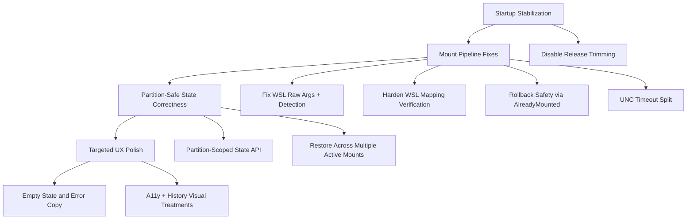

# Project TODO

> Generated by /deep-review on February 11, 2026
>
> **Purpose**: This document captures all identified improvements, bugs,
> and enhancements with full context so future work can be executed
> without losing the reasoning and intentions behind each task.

## Executive Summary
LiMount had overlapping regressions in release startup reliability (trim-sensitive runtime bindings) and mount pipeline correctness (WSL command invocation, rollback safety, and partition-scoped state cleanup). The highest-risk failures are now addressed in code, including release trimming disablement, raw WSL distro listing, partition-safe state APIs, and stronger mapping verification paths. Remaining work is focused on UI polish, additional diagnostics, and broader manual validation across real Windows + WSL environments.

## Task Dependency Graph

## Tasks

### 🔴 Critical (Block Deployment)
| ID | Task | Subtasks | Depends On | Context |
|----|------|----------|------------|---------|
| C1 | Disable release trimming for WinUI publish profiles | - Set `PublishTrimmed=false` for `win-x64`, `win-x86`, `win-arm64` - Keep ReadyToRun enabled | - | Prevents release startup crash (`Property Get method was not found`) caused by trim-sensitive reflection/runtime binding paths. |
| C2 | Correct WSL distro detection invocation | - Add raw WSL argument path (no forced `-e`) - Update disk-mounted detection to call `wsl -l -q` correctly - Add argument-construction unit tests | C1 | Fixes false-negative/invalid command path where `wsl -e -l -q` was used instead of raw distro-list call. |
| C3 | Make rollback non-destructive for existing mounts | - Extend mount script contract with `AlreadyMounted`/`UncVerified` - Parse in `MountResult` - Skip rollback unmount when target was pre-existing | C2 | Prevents accidental unmount of mounts that were not created by the current operation. |
| C4 | Harden WSL `subst` mapping validation | - Strict WSL UNC validation - Unsafe-character rejection in elevated task path - Idempotent same-target behavior - Elevated user-context verification with explicit failure | C2 | Eliminates false-success mapping outcomes and improves safety for scheduled-task command construction. |
| C5 | Partition-safe state unregister semantics | - Add partition-aware state APIs - Keep disk-only unregister as obsolete compatibility wrapper - Update rollback/UI call sites to partition-scoped cleanup | C2 | Prevents removing sibling partition entries when only one partition is unmounted/rolled back. |

### 🟠 High Priority
| ID | Task | Subtasks | Depends On | Context |
|----|------|----------|------------|---------|
| H1 | Split UNC existence timeout from retry delay | - Add `UncExistenceCheckTimeoutMs` config - Clamp value in orchestrator - Use dedicated timeout in UNC checks | C2 | Fixes hidden coupling where per-check timeout incorrectly reused retry delay, creating false negatives on slower systems. |
| H2 | Restore from all active mounts and clean only stale entries | - Evaluate all persisted mounts, not first-only - Remove only stale partition entries - Preserve current single-active UI behavior | C5 | Improves resilience after restart in multi-partition scenarios while avoiding destructive cleanup. |
| H3 | Manual release + mount pipeline validation pass | - Publish release and launch sanity check - Validate non-elevated/elevated mapping flows - Verify logs and rollback diagnostics | C1, C2, C3, C4, C5, H1, H2 | Confirms end-to-end behavior on real Windows + WSL where unit tests cannot fully model UAC/session behavior. |

### 🟡 Medium Priority
| ID | Task | Subtasks | Depends On | Context |
|----|------|----------|------------|---------|
| M1 | Mapping diagnostics and script contract coverage | - Add/expand tests around mapping result contracts and failure messaging - Add richer logging around scheduled-task verification path | C4 | Ensures long-term maintainability of hardened mapping logic. |
| M2 | Expand integration tests for multi-partition scenarios | - Mount p1 + p2, restart, verify restore behavior - Unmount one partition leaves sibling state intact | C5, H2 | Guards against regressions in the exact failure mode that triggered this recovery plan. |
| M3 | Trim-safe migration planning | - Inventory runtime `{Binding}` usage in release-critical views - Plan compiled binding/preservation strategy before re-enabling trim | C1 | Keeps startup reliability while preparing for future size/startup optimization work. |

### 🟢 Low Priority / Nice-to-Have
| ID | Task | Subtasks | Depends On | Context |
|----|------|----------|------------|---------|
| L1 | Empty-state UX polish beyond core status text | - Add explicit no-disk/no-partition/no-history guidance in UI surfaces - Improve recovery hints in dialogs | H2 | Improves user confidence and lowers support burden when prerequisites are missing. |
| L2 | Accessibility and history visual treatment pass | - Add a11y metadata for history/action controls - Distinct success/failure visual treatment in history list | H2 | Raises overall usability and perceived quality without changing core mount logic. |

### 💡 Future Considerations
- Revisit release trimming only after compiled-binding migration is complete and validated in CI publish checks.
- Consider introducing a dedicated mapping verification helper binary/API for more robust cross-integrity/session checks than shelling through scheduled tasks.
- Evaluate optional multi-active UI presentation so users can manage multiple mounted partitions simultaneously.

## Background & Reasoning
The regression was not a single bug. It was a coupled reliability issue across startup behavior, orchestration assumptions, and state lifecycle boundaries. Release trimming increased startup fragility in WinUI binding paths, while mount flow logic made assumptions that were safe for single-partition happy paths but unsafe for real multi-partition and pre-existing mount scenarios. The remediation strategy prioritized non-destructive behavior first (do no harm), then correctness in command invocation and state granularity, and finally UX clarity so failures are actionable rather than opaque.

## Open Questions
- ✅ Keep multi-partition support? **Resolved:** Yes.
- ✅ Keep `subst` strategy for WSL UNC mapping? **Resolved:** Yes, with hardened validation and verification.
- ✅ Disable release trimming now? **Resolved:** Yes, deferred until trim-safe binding/preservation migration is complete.

## Incident Completion Notes (Second Drive Root Partition)
- `wsl --mount ... Invalid argument` was confirmed against WSL `dmesg` as unsupported XFS features, not just a generic script failure.
- Mount failure output now carries diagnostic fields (`ErrorCode`, `ErrorHint`, `DmesgSummary`) so UI/logs can explain kernel incompatibility directly.
- Filesystem detection was corrected to be disk-identity aware, preventing cross-disk partition-number mismatches.
- Deterministic app-level UI automation was added (`LiMount.UITests`) with `LIMOUNT_TEST_MODE` and scenario injection, plus optional screenshot capture.
- Real hardware-in-loop helper script was added (`scripts/run-hil-mount-test.ps1`) to validate this exact class of regression on local Windows + WSL.
- Startup false-positive mount detection was fixed by switching from `/mnt/wsl` directory listing checks to live mount-table checks, with best-effort stale directory cleanup.
- Unmount flow now treats WSL detach `ERROR_FILE_NOT_FOUND` / `Wsl/Service/DetachDisk` responses as already-detached success for cleanup correctness.
- Mapping verification was hardened to normalize UNC forms reported by `subst` (including `UNC\...`) to avoid false failures.

## Session Verification Evidence (February 11, 2026)
- `dotnet test LiMount.Tests` passed (`284` tests).
- `dotnet test LiMount.UITests` passed (`2` tests) with actionable status assertions for unsupported-XFS and success scenarios.
- HIL expected-failure scenario passed for unsupported partition:
  - `powershell -ExecutionPolicy Bypass -File .\scripts\run-hil-mount-test.ps1 -DiskIndex 1 -Partition 2 -ExpectXfsUnsupported`
- HIL drive-level verification passed:
  - `powershell -ExecutionPolicy Bypass -File .\scripts\run-hil-mount-test.ps1 -DiskIndex 1 -VerifyDriveEndToEnd -FailurePartition 2`
  - Expected failure on partition 2 and successful mount+unmount on partition 1 were both confirmed.
