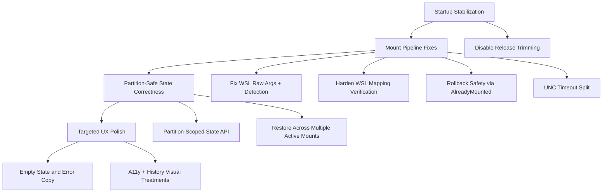

# Project TODO

> Generated by /deep-review on February 11, 2026
>
> **Purpose**: This document captures all identified improvements, bugs,
> and enhancements with full context so future work can be executed
> without losing the reasoning and intentions behind each task.

## Executive Summary

LiMount had overlapping regressions in release startup reliability (trim-sensitive runtime bindings) and mount pipeline correctness (WSL command invocation, rollback safety, and partition-scoped state cleanup). The highest-risk failures are now addressed in code, including release trimming disablement, raw WSL distro listing, partition-safe state APIs, and stronger mapping verification paths. The NL1 contract shift is now implemented: `NetworkLocation` is the default Windows access mode, `DriveLetterLegacy` remains explicit legacy behavior, and `None` is mount-only. Remaining work is focused on VM fallback execution (`HV1/HV2/GA1/CO1`), HIL fallback validation, and follow-up docs for VM-specific flows.

## Task Dependency Graph



## Tasks

### 🔴 Critical (Block Deployment)

| ID | Task | Subtasks | Depends On | Context |
|----|------|----------|------------|---------|
| C1 | Disable release trimming for WinUI publish profiles | - Set `PublishTrimmed=false` for `win-x64`, `win-x86`, `win-arm64`<br>- Keep ReadyToRun enabled | - | Prevents release startup crash (`Property Get method was not found`) caused by trim-sensitive reflection/runtime binding paths. |
| C2 | Correct WSL distro detection invocation | - Add raw WSL argument path (no forced `-e`)<br>- Update disk-mounted detection to call `wsl -l -q` correctly<br>- Add argument-construction unit tests | C1 | Fixes false-negative/invalid command path where `wsl -e -l -q` was used instead of raw distro-list call. |
| C3 | Make rollback non-destructive for existing mounts | - Extend mount script contract with `AlreadyMounted`/`UncVerified`<br>- Parse in `MountResult`<br>- Skip rollback unmount when target was pre-existing | C2 | Prevents accidental unmount of mounts that were not created by the current operation. |
| C4 | Harden WSL `subst` mapping validation | - Strict WSL UNC validation<br>- Unsafe-character rejection in elevated task path<br>- Idempotent same-target behavior<br>- Elevated user-context verification with explicit failure | C2 | Eliminates false-success mapping outcomes and improves safety for scheduled-task command construction. |
| C5 | Partition-safe state unregister semantics | - Add partition-aware state APIs<br>- Keep disk-only unregister as obsolete compatibility wrapper<br>- Update rollback/UI call sites to partition-scoped cleanup | C2 | Prevents removing sibling partition entries when only one partition is unmounted/rolled back. |

### 🟠 High Priority

| ID | Task | Subtasks | Depends On | Context |
|----|------|----------|------------|---------|
| H1 | Split UNC existence timeout from retry delay | - Add `UncExistenceCheckTimeoutMs` config<br>- Clamp value in orchestrator<br>- Use dedicated timeout in UNC checks | C2 | Fixes hidden coupling where per-check timeout incorrectly reused retry delay, creating false negatives on slower systems. |
| H2 | Restore from all active mounts and clean only stale entries | - Evaluate all persisted mounts, not first-only<br>- Remove only stale partition entries<br>- Preserve current single-active UI behavior | C5 | Improves resilience after restart in multi-partition scenarios while avoiding destructive cleanup. |
| H3 | Manual release + mount pipeline validation pass | - Publish release and launch sanity check<br>- Validate non-elevated/elevated mapping flows<br>- Verify logs and rollback diagnostics | C1, C2, C3, C4, C5, H1, H2 | Confirms end-to-end behavior on real Windows + WSL where unit tests cannot fully model UAC/session behavior. |

### 🟡 Medium Priority

| ID | Task | Subtasks | Depends On | Context |
|----|------|----------|------------|---------|
| M1 | Mapping diagnostics and script contract coverage | - Add/expand tests around mapping result contracts and failure messaging<br>- Add richer logging around scheduled-task verification path | C4 | Ensures long-term maintainability of hardened mapping logic. |
| M2 | Expand integration tests for multi-partition scenarios | - Mount p1 + p2, restart, verify restore behavior<br>- Unmount one partition leaves sibling state intact | C5, H2 | Guards against regressions in the exact failure mode that triggered this recovery plan. |
| M3 | Trim-safe migration planning | - Inventory runtime `{Binding}` usage in release-critical views<br>- Plan compiled binding/preservation strategy before re-enabling trim | C1 | Keeps startup reliability while preparing for future size/startup optimization work. |

### 🟢 Low Priority / Nice-to-Have

| ID | Task | Subtasks | Depends On | Context |
|----|------|----------|------------|---------|
| L1 | Empty-state UX polish beyond core status text | - Add explicit no-disk/no-partition/no-history guidance in UI surfaces<br>- Improve recovery hints in dialogs | H2 | Improves user confidence and lowers support burden when prerequisites are missing. |
| L2 | Accessibility and history visual treatment pass | - Add a11y metadata for history/action controls<br>- Distinct success/failure visual treatment in history list | H2 | Raises overall usability and perceived quality without changing core mount logic. |

---

## 1) TODO.md patch addendum (matches current style)

### Where to insert

In `TODO.md`, insert this block **right before** the existing section:

```md
### 💡 Future Considerations
```

### Patch block to insert

````md
---

## VM Fallback + Network Locations Roadmap (Hyper-V Preferred)

> Addendum created on February 12, 2026
>
> Goal: Prefer Hyper-V when available, provide a first-run detection + setup wizard, support silent VM fallback for filesystem incompatibility (notably `XFS_UNSUPPORTED_FEATURES`), and move default Windows integration from drive letters to Explorer "Network Locations".

### Task Dependency Graph (VM Fallback + Access Mode)

```mermaid
graph TD
    V0[Settings + Capability Detection] --> V1[First-run Setup Wizard]
    V1 --> NL1[Network Locations (default) + Legacy Drive Letters]
    V1 --> HV1[Hyper-V Provider Host Control]
    HV1 --> HV2[Appliance Provisioning + Resource Sizing]
    HV2 --> GA1[Guest Agent: SSH + Samba Share]
    NL1 --> CO1[MountCoordinator: WSL/Vm + Silent Fallback + VM-only option]
    GA1 --> CO1

    CO1 --> TST1[Deterministic Tests + UI Tests]
    CO1 --> HIL1[HIL VM Fallback Verification]
    CO1 --> DOC1[Docs + README Updates]

    V1 --> VMW1[VMware Provider (optional)]
    V1 --> VB1[VirtualBox Provider (optional)]
    NL1 --> NL2[Drive Letter Deprecation (optional)]
````

### 🟠 High Priority

| ID  | Task                                                                      | Subtasks                                                                                                                                                                                                                                                                                                                                                                                                                    | Depends On | Context                                                                                                                                                                                                                                                                                              |
| --- | ------------------------------------------------------------------------- | --------------------------------------------------------------------------------------------------------------------------------------------------------------------------------------------------------------------------------------------------------------------------------------------------------------------------------------------------------------------------------------------------------------------------- | ---------- | ---------------------------------------------------------------------------------------------------------------------------------------------------------------------------------------------------------------------------------------------------------------------------------------------------- |
| V0  | Add per-user settings + platform capability detection                     | - Add `UserSettings` persisted in `%LocalAppData%\LiMount\settings.json` with versioning<br>- Add `PlatformCapabilities` detector (Windows edition, Hyper-V support/enabled, WSL present, VMware/VirtualBox installed)<br>- Add constants for external help/download links (Hyper-V install docs, WSL install docs, VMware download instructions, VirtualBox downloads)                                                     | -          | Enables first-run wizard + provider gating, and drives backend/access-mode decisions. Hyper-V cannot be installed on Windows Home; detect and communicate clearly. Hyper-V enablement uses `Enable-WindowsOptionalFeature -Online -FeatureName Microsoft-Hyper-V -All` and requires admin + restart. |
| V1  | First-run Setup Wizard: detect + choose provider + actions                | - Add wizard dialog with steps: environment scan → mount strategy → provider selection → access mode → performance profile → summary/test<br>- Provider list shows Hyper-V/VMware/VirtualBox with unavailable options disabled (greyed) + reason<br>- Add action buttons (Enable Hyper-V (Admin), Open WSL install docs, Download VMware/VirtualBox links)<br>- Persist selected provider + strategy + access mode + sizing | V0         | User flow must be explicit and actionable; provide clickable links for downloads and docs. Warn that Hyper-V can conflict with other hypervisors; link to Microsoft troubleshooting for virtualization apps and Hyper-V.                                                                             |
| NL1 | Default Windows integration: Network Locations (WSL + VM)                 | - Add `IWindowsAccessService` abstraction with `NetworkLocation` default and `DriveLetterLegacy` optional<br>- Add `scripts/network/Create-NetworkLocation.ps1` and `Remove-NetworkLocation.ps1` (NetHood-based shortcut folder + `target.lnk`)<br>- Update mount/unmount orchestration to create/remove network locations instead of drive letters by default<br>- Keep current drive-letter mapping behind legacy setting | V0, V1     | Drive letters are fragile (session/UAC/verification complexity). Network Locations reduce friction and avoid "system drive" feel. Network locations live under `%AppData%\Microsoft\Windows\Network Shortcuts` (shell:NetHood).                                                                      |
| HV1 | Hyper-V provider baseline: VM lifecycle + pass-through disk attach/detach | - Add `IHypervisorProvider` + `HyperVProvider` implementation<br>- Implement scripts: `Ensure-LiMountApplianceVm`, `Start/Stop`, `Attach/Detach-PhysicalDiskToVm`, `Get-VmIpAddress`<br>- Enforce pass-through rule: physical disk must be Offline on host when attached via `Add-VMHardDiskDrive -DiskNumber`<br>- Add rollback: restore disk offline/online state after detach                                            | V0, V1     | Hyper-V should be preferred when available. Pass-through disk attachment requires offline physical disk and exclusive host access; LiMount must manage this transaction safely and restore state on cleanup.                                                                                         |
| HV2 | Appliance provisioning + "minimal host impact" sizing policy              | - Wizard step: auto-size resources based on host CPU/RAM<br>- Default: low-impact vCPU + dynamic RAM + "save state when idle" option<br>- VM config: Gen2, suitable firmware/boot settings, headless friendly<br>- Network mode selection: Default Switch vs internal switch (advanced)                                                                                                                                     | HV1, V1    | Keeps performance good and host impact low; avoids user needing to hand-tune Hyper-V VM settings.                                                                                                                                                                                                    |
| GA1 | Guest automation: SSH mount + Samba share export                          | - Add `IGuestCommandTransport` and SSH implementation (keys stored securely; redact logs)<br>- Add guest agent scripts/command contract: mount read-only by default; export via Samba; return share path<br>- Add share verification and UNC construction `\\<vm-ip>\limount` (or subpath)<br>- Add "Test configuration" button in wizard                                                                                   | HV2        | VM fallback must actually produce Windows access. SMB share is the practical return path. Default read-only for safety.                                                                                                                                                                              |
| CO1 | MountCoordinator: WSL preferred + silent VM fallback + VM-only mode       | - Add `IMountCoordinator` orchestrating: WSL backend then VM backend per user preference<br>- Add "Always use LiMount VM instead of WSL" option (VM preferred/only)<br>- Implement silent fallback on WSL failures classified as filesystem incompatibility (start with `XFS_UNSUPPORTED_FEATURES`)<br>- UI: non-blocking banner "Mounted via VM fallback" + diagnostics link                                               | NL1, GA1   | Makes fallback seamless: user stays productive when WSL kernel can't mount. Provides explicit VM-only mode for maximum compatibility.                                                                                                                                                                |

### 🟡 Medium Priority

| ID   | Task                                                      | Subtasks                                                                                                                                                                                                                                                                   | Depends On    | Context                                                                             |
| ---- | --------------------------------------------------------- | -------------------------------------------------------------------------------------------------------------------------------------------------------------------------------------------------------------------------------------------------------------------------- | ------------- | ----------------------------------------------------------------------------------- |
| TST1 | Deterministic tests + UI tests for wizard/access/fallback | - Extend `TestMode` scenarios: missing settings triggers wizard; provider gating; WSL fails then VM succeeds<br>- Add unit tests for coordinator decision logic + rollback ordering<br>- Update `LiMount.UITests` to validate network location UX instead of drive letters | V1, NL1, CO1  | Prevents regressions across complex setup/fallback flows.                           |
| TST2 | Deferred VM fallback E2E screenshot batch (mounted + Explorer) | - Enable only after `CO1` + `HIL1` are complete<br>- Capture mounted-state screenshot after VM fallback success and active mount<br>- Capture Windows Explorer screenshot with the network share open<br>- Use deterministic filenames `vm-fallback-mounted.png` and `vm-fallback-explorer-network-share-open.png` under `screenshots/ui-batch/<timestamp>/` | CO1, HIL1 | Adds explicit visual acceptance evidence for VM fallback UX and network-share Explorer integration. |
| HIL1 | HIL VM fallback verification harness                      | - Add `scripts/run-hil-vm-fallback-test.ps1` to validate: WSL unsupported -> VM fallback success -> cleanup<br>- Add integration test docs updates with env vars and prerequisites                                                                                         | CO1, HV1, GA1 | Real hardware validation is essential for disk attach + UAC + networking realities. |
| DOC1 | Documentation updates (README + setup + troubleshooting)  | - README: "Network Locations default", "Hyper-V preferred fallback", "VM-only mode"<br>- Docs: first-run wizard guide; Hyper-V enablement; troubleshooting share/auth; fallback triggers                                                                                   | NL1, CO1      | Keeps the feature discoverable and reduces support load.                            |
| VMW1 | VMware provider (optional)                                | - Detect vmrun and show wizard option when installed<br>- Basic start/stop + guest connectivity<br>- Disk attach automation later (behind feature flag)                                                                                                                    | V1            | Covers Windows Home and users who prefer VMware.                                    |
| VB1  | VirtualBox provider (optional)                            | - Detect VBoxManage and show wizard option when installed<br>- Raw disk mapping via VBoxManage (expert-mode warning)                                                                                                                                                       | V1            | Secondary provider; raw disk access has notable risk; keep gated and documented.    |

### 🟢 Low Priority / Nice-to-Have

| ID   | Task                                              | Subtasks                                                                                                                                                                     | Depends On | Context                                                      |
| ---- | ------------------------------------------------- | ---------------------------------------------------------------------------------------------------------------------------------------------------------------------------- | ---------- | ------------------------------------------------------------ |
| NL2  | Drive-letter deprecation + UI simplification      | - Hide drive-letter UI behind "Legacy" toggle<br>- Remove drive-letter assumptions from restore/state paths<br>- Keep legacy mapping only for those who explicitly enable it | NL1, CO1   | Reduces complexity long-term; lowers UAC/session edge cases. |
| OPT1 | Appliance image lifecycle (download/update)       | - Download-on-demand appliance image (or provisioning via cloud-init)<br>- Version/checksum verification + update prompts                                                    | HV2        | Improves UX and reduces manual VM management.                |
| OPT2 | Multi-mount + concurrent sessions across backends | - Support multiple active mounts and isolate share paths<br>- Add locking for disk attach conflicts                                                                          | CO1        | Future scalability once single-mount UX is stable.           |

### Implementation Progress (2026-02-12)

- V0 is implemented:
  - Added user settings persistence (`%LocalAppData%\LiMount\settings.json`) and versioned settings model/service.
  - Added platform capability detection service/model with unavailable-reason strings for UI.
  - VMware/VirtualBox detection now checks PATH, Program Files, and registry install paths.
- V1 core wizard slice is implemented:
  - First-run setup wizard is wired before strict startup validation.
  - Wizard persists mount strategy, fallback policy, hypervisor selection, and Windows access mode.
  - Sensible first-run defaults are auto-selected:
    - `BackendPreference=WslPreferred`
    - `VmFallbackPolicy=OnFsIncompatibility` when any VM provider is available, otherwise `Disabled`
    - Hypervisor recommendation priority: Hyper-V -> VMware -> VirtualBox -> Auto
    - `AccessMode=NetworkLocation`
  - Buttons are now conditional:
    - Hide `Enable Hyper-V` when Hyper-V is already ready.
    - Hide VMware/VirtualBox download buttons when those tools are detected.
  - Hyper-V status text is only shown when relevant (no default "action not run" noise).
- Detection hardening completed after field feedback:
  - Removed PowerShell probes from `PlatformCapabilityService` for Hyper-V capability checks.
  - Hyper-V detection now uses `dism.exe` + native WMI/service/module checks.
  - Hyper-V enable action now runs elevated `dism.exe` instead of elevated PowerShell.
- Verification evidence (latest run):
  - `dotnet build --nologo` passed.
  - `dotnet test LiMount.Tests --nologo --filter FullyQualifiedName~LiMount.Tests.Services.PlatformCapabilityServiceTests` passed (11 tests).
  - `dotnet test LiMount.Tests --nologo --filter FullyQualifiedName~LiMount.Tests.Services.HyperVEnableServiceTests` passed (7 tests).
  - `dotnet test LiMount.Tests --nologo --filter FullyQualifiedName~LiMount.Tests.ViewModels.SetupWizardViewModelTests` passed (5 tests).
  - `dotnet test LiMount.Tests --nologo --filter FullyQualifiedName~LiMount.Tests.Services.SetupWizardServiceTests` passed (4 tests).
  - `LIMOUNT_RUN_UI_TESTS=1 dotnet test LiMount.UITests --nologo` passed (3 tests).
- NL1 is now implemented:
  - Added `IWindowsAccessService` with mode-based routing (`NetworkLocation`, `DriveLetterLegacy`, `None`).
  - Added `scripts/network/Create-NetworkLocation.ps1` and `scripts/network/Remove-NetworkLocation.ps1`.
  - Updated mount/unmount orchestrators and contracts to be access-mode-first.
  - Updated state/history/result models to persist access metadata.
  - Updated UI/TestMode and screenshot batch tests for default hidden drive-letter picker in `NetworkLocation` mode.
- Remaining roadmap items not started in this slice: `HV1`, `HV2`, `GA1`, `CO1`, `TST2`, `HIL1`.
- `DOC1` is partially started (NL1 docs updated); VM fallback documentation remains pending `CO1`.

### Open Questions (VM Roadmap)

* Should VM fallback be strictly read-only in the first release (recommended), or allow write mode behind an explicit confirmation?
* Should Hyper-V internal switch + static IP be the default (stability) or Default Switch (simplicity)?
* Should VM fallback be allowed when the disk is "in use" on host, or should LiMount refuse and guide the user to close handles/offline the disk?

---

### Notes about correctness (why these statements belong in TODO Context)

- Hyper‑V install requirements and the note that it can't be installed on Windows Home are explicitly stated in Microsoft's Hyper‑V install doc. :contentReference[oaicite:0]{index=0}
* Enabling Hyper‑V via `Enable-WindowsOptionalFeature … Microsoft-Hyper-V -All` is also in that doc. :contentReference[oaicite:1]{index=1}
* Hyper‑V passthrough attachment uses `Add-VMHardDiskDrive -DiskNumber` and requires the disk to be offline, per the cmdlet docs. :contentReference[oaicite:2]{index=2}
* For the wizard warning about other virtualization apps: Microsoft provides guidance on disabling Hyper‑V to make virtualization apps work again. :contentReference[oaicite:3]{index=3}
* Network Locations location is under `%AppData%\Microsoft\Windows\Network Shortcuts` (shell:NetHood), and the structure includes `desktop.ini` + `target.lnk` (practical reference). :contentReference[oaicite:4]{index=4}
* Download links: VMware Workstation download instructions via Broadcom KB and VirtualBox downloads page. :contentReference[oaicite:5]{index=5}
* WSL install docs for wizard actions/links. :contentReference[oaicite:6]{index=6}

---

## 2) GitHub Issues pack (Epic + child issues)

Below is a "create issues" set. Each issue references the TODO IDs so you can track across both.

### Epic: VM Fallback + Network Locations (Hyper‑V preferred)

**Title:** Epic: Hyper‑V preferred VM appliance, silent fallback, Network Locations default
**Labels:** `epic`, `vm-fallback`, `hyperv`, `ux`, `migration`
**Milestone:** `VM Fallback v1`

**Description (paste):**
* Deliver Hyper‑V preferred VM fallback with first-run wizard and silent fallback on filesystem incompatibility.
* Move Windows integration from drive letters to Explorer Network Locations by default, for both WSL and VM mounts.
* Keep drive letters as legacy mode initially.

**Definition of Done:**
* Wizard exists, provider selection works with disabled options and actionable links.
* Network Locations used by default.
* Silent fallback works for `XFS_UNSUPPORTED_FEATURES` when enabled.
* HIL script validates end-to-end on real hardware.

---

### Issue 1 (V0): User settings + capability detection

**Title:** V0: Add per-user settings + platform capabilities detection
**Labels:** `feature`, `core`, `settings`, `detection`
**Depends on:** none

**Checklist**
* [ ] Add `UserSettings` model with versioning in `%LocalAppData%\LiMount\settings.json`
* [ ] Add `PlatformCapabilities` model and `IPlatformCapabilityService`
* [ ] Detect Windows edition + Hyper‑V support/enabled and WSL presence :contentReference[oaicite:7]{index=7}
* [ ] Detect VMware (`vmrun.exe`) and VirtualBox (`VBoxManage.exe`) presence
* [ ] Add `ExternalLinks.cs` constants (see Issue 2)

**Acceptance criteria**
* App can load/save settings and populate capability matrix reliably.
* Capabilities include "why disabled" reasons (e.g., Windows Home blocks Hyper‑V). :contentReference[oaicite:8]{index=8}

---

### Issue 2 (V1): First-run Setup Wizard with provider gating and actions/links

**Title:** V1: Setup Wizard dialog (first run / missing settings) with hypervisor selection + install/enable actions
**Labels:** `feature`, `ux`, `winui`, `wizard`
**Depends on:** Issue 1 (V0)

**UI requirements**
* Provider list:
  * Hyper‑V / VMware / VirtualBox radio choices
  * Unavailable options disabled (grey) with reason + hyperlink/button actions
* Actions:
  * Enable Hyper‑V (admin) using `Enable-WindowsOptionalFeature -Online -FeatureName Microsoft-Hyper-V -All` (restart required) :contentReference[oaicite:9]{index=9}
  * Open WSL install docs :contentReference[oaicite:10]{index=10}
  * VMware download instructions :contentReference[oaicite:11]{index=11}
  * VirtualBox downloads :contentReference[oaicite:12]{index=12}
  * Show warning/help link about Hyper‑V affecting other virtualization apps :contentReference[oaicite:13]{index=13}

**Implementation checklist**
* [ ] `SetupWizardDialog.xaml` + `SetupWizardViewModel`
* [ ] `ExternalLinks.cs` (URLs stored in code)
* [ ] `LinkOpenerService` to open hyperlinks (and unit test it with a fake)
* [ ] Wizard persists selected strategy/provider/access mode/sizing into settings
* [ ] Add "Test configuration" button that runs lightweight checks (no disk attach yet)

**Acceptance criteria**
* Wizard appears on first run or missing config.
* Provider list matches detection results; reasons are correct; links open.

**Code constants file (safe to paste)**
```csharp
public static class ExternalLinks
{
    public const string HyperVInstallDocs =
        "https://learn.microsoft.com/en-us/windows-server/virtualization/hyper-v/get-started/install-hyper-v";

    public const string WslInstallDocs =
        "https://learn.microsoft.com/en-us/windows/wsl/install";

    public const string VmwareWorkstationDownload =
        "https://knowledge.broadcom.com/external/article/344595/downloading-and-installing-vmware-workst.html";

    public const string VirtualBoxDownloads =
        "https://www.virtualbox.org/wiki/Downloads";

    public const string HyperVVirtualizationAppsTroubleshooting =
        "https://learn.microsoft.com/en-us/troubleshoot/windows-client/application-management/virtualization-apps-not-work-with-hyper-v";
}
````

---

### Issue 3 (NL1): Network Locations access mode (default) + legacy drive letters

**Title:** NL1: Implement Network Locations as default Windows access mode (WSL + VM)
**Labels:** `feature`, `migration`, `windows-integration`, `scripts`
**Depends on:** Issue 1 (V0) + Issue 2 (V1)

**Checklist**

* [x] Add `IWindowsAccessService` with:

  * NetworkLocation (default)
  * DriveLetterLegacy (existing scripts)
  * None (mount-only, no Windows integration)
* [x] Add scripts:

  * `scripts/network/Create-NetworkLocation.ps1`
  * `scripts/network/Remove-NetworkLocation.ps1`
* [x] Update orchestrator to use access service rather than always mapping drive letters
* [x] Update UI to default to Network Location naming (no drive letter selection)
* [x] Update mount-state reconciliation so non-legacy modes are not pruned for missing drive letters

**Acceptance criteria**

* WSL mount creates a Network Location pointing to the UNC. ✅
* Unmount removes it. ✅
* Drive-letter mapping remains available via `DriveLetterLegacy` mode. ✅

(References: location and structure for NetHood shortcuts. ([Super User][1]))

---

### Issue 4 (HV1): Hyper‑V provider host control + pass-through disk lifecycle

**Title:** HV1: Hyper‑V provider (start/stop VM + attach/detach physical disk via DiskNumber)
**Labels:** `feature`, `hyperv`, `elevation`, `safety`
**Depends on:** Issue 1 (V0)

**Checklist**

* [ ] `IHypervisorProvider` + `HyperVProvider`
* [ ] Scripts:

  * Ensure VM exists/configured
  * Start/Stop
  * Attach/Detach physical disk with rollback
* [ ] Enforce "disk must be Offline before attach" rule (required by cmdlet) ([Microsoft Learn][2])
* [ ] Restore original disk state on detach (offline/online/read-only flags)

**Acceptance criteria**

* Hyper‑V provider can attach/detach disk reliably on supported Windows editions. ([Microsoft Learn][3])
* If disk cannot be offlined, LiMount fails early with actionable guidance.

---

### Issue 5 (HV2): Appliance provisioning + resource sizing

**Title:** HV2: Provision LiMount Hyper‑V appliance + minimal-host-impact sizing policy
**Labels:** `feature`, `hyperv`, `performance`, `ux`
**Depends on:** Issue 4 (HV1) + Issue 2 (V1)

**Checklist**

* [ ] Auto-sizing heuristic implementation
* [ ] Wizard UI exposes "Auto-size" and advanced override
* [ ] VM config:

  * Gen2
  * Dynamic memory
  * Preferred stop mode (Save state vs shutdown)
* [ ] Switch selection (Default Switch vs internal)

**Acceptance criteria**

* On low-end machines, defaults don't starve host.
* User can override CPU/RAM in advanced mode.

---

### Issue 6 (GA1): Guest agent (SSH) + Samba share

**Title:** GA1: Guest mount agent via SSH + Samba export (read-only default)
**Labels:** `feature`, `security`, `vm-fallback`, `linux`
**Depends on:** Issue 5 (HV2)

**Checklist**

* [ ] SSH command transport with secure key storage (DPAPI/CredMan)
* [ ] Guest-side mount script/agent contract:

  * Mount read-only by default
  * Export via Samba
  * Return share path
* [ ] Validate share reachable and build UNC `\\<ip>\limount`
* [ ] Wizard "Test configuration" validates SSH + share

**Acceptance criteria**

* VM mount produces a reachable UNC path that Explorer can open.
* Unmount removes export + unmounts cleanly.
* No secrets appear in logs.

---

### Issue 7 (CO1): Coordinator + silent fallback + VM-only option

**Title:** CO1: MountCoordinator (WSL preferred + silent VM fallback + VM-only strategy)
**Labels:** `feature`, `orchestration`, `ux`, `resilience`
**Depends on:** Issue 3 (NL1) + Issue 6 (GA1)

**Checklist**

* [ ] Introduce `IMountCoordinator` and backend wrappers
* [ ] Add settings:

  * WSL preferred + fallback enabled
  * VM preferred / VM only
* [ ] Silent fallback behavior:

  * If WSL fails with `XFS_UNSUPPORTED_FEATURES`, try VM and continue without modal
  * Show non-blocking banner "Mounted via VM fallback"
* [ ] Persist backend/access mode in mount state/history

**Acceptance criteria**

* With fallback enabled, unsupported XFS mounts "just succeed" via VM with a small status indicator.
* VM-only mode works end-to-end.
* State restore does not delete VM mounts just because VM is off.

---

### Issue 8 (TST1): Deterministic tests + UI tests update for Network Locations

**Title:** TST1: Extend deterministic tests for wizard/provider gating + network location UX + fallback
**Labels:** `tests`, `ui-tests`, `regression`
**Depends on:** Issues 2,3,7

**Checklist**

* [ ] TestMode scenario: missing settings -> wizard
* [ ] TestMode scenario: WSL fails with XFS unsupported -> VM fallback succeeds
* [x] Update `LiMount.UITests` assertions from drive letters to Network Location/UNC open behavior
* [x] Keep deterministic screenshot batch naming while default mode hides drive-letter picker
* [ ] Add unit tests for coordinator decision logic and rollback ordering

**Acceptance criteria**

* CI passes deterministic tests for the new UX and orchestration paths.

---

### Issue 9 (HIL1): HIL VM fallback test script

**Title:** HIL1: Add `run-hil-vm-fallback-test.ps1` + docs
**Labels:** `hil`, `integration`, `hyperv`
**Depends on:** Issue 7 (CO1)

**Checklist**

* [ ] HIL script validates:

  * WSL expected failure (`XFS_UNSUPPORTED_FEATURES`)
  * VM fallback success
  * Windows can enumerate files via UNC / network location
  * Cleanup restores disk state and removes access
* [ ] Document required prerequisites and environment variables

**Acceptance criteria**

* Reproducible end-to-end verification on real hardware.

---

### Issue 10 (DOC1): Docs and README updates

**Title:** DOC1: Document wizard, Hyper‑V requirements, Network Locations, VM-only mode, fallback triggers
**Labels:** `docs`
**Depends on:** Issues 2,3,7

**Checklist**

* [x] README and testing docs updated for current NL1 behavior (Network Locations default, legacy/none modes, screenshot workflow)
* [ ] Add docs for VM fallback and VM-only flows once `CO1` is implemented:

  * `docs/setup/first-run-wizard.md`
  * `docs/vm-fallback/hyperv.md`
  * `docs/setup/network-locations.md`
  * `docs/security/credentials.md`
  * `docs/testing/hil-vm-fallback.md`
* [ ] Update incident follow-up doc to link to VM fallback after fallback implementation lands

**Acceptance criteria**

* Docs are sufficient for a clean "fresh machine" setup without tribal knowledge.

---

### Issue 11 (VMW1): VMware provider (optional)

**Title:** VMW1: VMware provider detection + wizard integration (experimental)
**Labels:** `feature`, `vmware`, `experimental`
**Depends on:** Issue 2 (V1)

**Checklist**

* [ ] Detect `vmrun.exe`
* [ ] Add provider option in wizard (enabled only if installed)
* [ ] Provide download instructions link ([Support Portal][4])
* [ ] Implement minimal start/stop + guest reachability (disk attach later)

---

### Issue 12 (VB1): VirtualBox provider (optional)

**Title:** VB1: VirtualBox provider detection + wizard integration (experimental)
**Labels:** `feature`, `virtualbox`, `experimental`
**Depends on:** Issue 2 (V1)

**Checklist**

* [ ] Detect `VBoxManage.exe`
* [ ] Provide download link ([VirtualBox][5])
* [ ] Optional raw disk mapping later; warn about raw disk risks per Oracle docs ([Oracle Docs][6])

---

## Quick "what to do next" suggestion

If you're sequencing for fastest value:

1. **V0 + V1 (settings + wizard)** ✅
2. **NL1 (Network Locations default for WSL)** ✅
3. **HV1 + HV2 (Hyper‑V provider + appliance provisioning)** (next)
4. **GA1 (guest agent)**
5. **CO1 (silent fallback + VM-only)**
6. HIL VM fallback + remaining docs (TST2/HIL1/DOC1)

This order gives visible progress early and reduces scope risk.

References:

[1]: https://superuser.com/questions/1781239/how-can-i-create-a-shortcut-in-this-pc-on-windows-10?utm_source=chatgpt.com "How can I create a shortcut in \"This PC\" on windows 10?"
[2]: https://learn.microsoft.com/en-us/powershell/module/hyper-v/add-vmharddiskdrive?view=windowsserver2025-ps&utm_source=chatgpt.com "Add-VMHardDiskDrive (Hyper-V)"
[3]: https://learn.microsoft.com/en-us/windows-server/virtualization/hyper-v/get-started/install-hyper-v?utm_source=chatgpt.com "Install Hyper-V in Windows and Windows Server"
[4]: https://knowledge.broadcom.com/external/article/344595/downloading-and-installing-vmware-workst.html?utm_source=chatgpt.com "Downloading VMware Workstation Pro"
[5]: https://www.virtualbox.org/wiki/Downloads?utm_source=chatgpt.com "Downloads"
[6]: https://docs.oracle.com/en/virtualization/virtualbox/6.0/admin/adv-storage-config.html?utm_source=chatgpt.com "2.8. Advanced Storage Configuration"

---

### 💡 Future Considerations

- Revisit release trimming only after compiled-binding migration is complete and validated in CI publish checks.
* Consider introducing a dedicated mapping verification helper binary/API for more robust cross-integrity/session checks than shelling through scheduled tasks.
* Evaluate optional multi-active UI presentation so users can manage multiple mounted partitions simultaneously.

## Background & Reasoning

The regression was not a single bug. It was a coupled reliability issue across startup behavior, orchestration assumptions, and state lifecycle boundaries. Release trimming increased startup fragility in WinUI binding paths, while mount flow logic made assumptions that were safe for single-partition happy paths but unsafe for real multi-partition and pre-existing mount scenarios. The remediation strategy prioritized non-destructive behavior first (do no harm), then correctness in command invocation and state granularity, and finally UX clarity so failures are actionable rather than opaque.

## Open Questions

- ✅ Keep multi-partition support? **Resolved:** Yes.
* ✅ Keep `subst` strategy for WSL UNC mapping? **Resolved:** Yes, with hardened validation and verification.
* ✅ Disable release trimming now? **Resolved:** Yes, deferred until trim-safe binding/preservation migration is complete.

## Incident Completion Notes (Second Drive Root Partition)

- `wsl --mount ... Invalid argument` was confirmed against WSL `dmesg` as unsupported XFS features, not just a generic script failure.
* Mount failure output now carries diagnostic fields (`ErrorCode`, `ErrorHint`, `DmesgSummary`) so UI/logs can explain kernel incompatibility directly.
* Filesystem detection was corrected to be disk-identity aware, preventing cross-disk partition-number mismatches.
* Deterministic app-level UI automation was added (`LiMount.UITests`) with `LIMOUNT_TEST_MODE` and scenario injection, plus optional screenshot capture.
* Real hardware-in-loop helper script was added (`scripts/run-hil-mount-test.ps1`) to validate this exact class of regression on local Windows + WSL.
* Startup false-positive mount detection was fixed by switching from `/mnt/wsl` directory listing checks to live mount-table checks, with best-effort stale directory cleanup.
* Unmount flow now treats WSL detach `ERROR_FILE_NOT_FOUND` / `Wsl/Service/DetachDisk` responses as already-detached success for cleanup correctness.
* Mapping verification was hardened to normalize UNC forms reported by `subst` (including `UNC\...`) to avoid false failures.

## Session Verification Evidence (February 11, 2026)

- `dotnet test LiMount.Tests` passed (`284` tests).
* `dotnet test LiMount.UITests` passed (`2` tests) with actionable status assertions for unsupported-XFS and success scenarios.
* HIL expected-failure scenario passed for unsupported partition:
  * `powershell -ExecutionPolicy Bypass -File .\scripts\run-hil-mount-test.ps1 -DiskIndex 1 -Partition 2 -ExpectXfsUnsupported`
* HIL drive-level verification passed:
  * `powershell -ExecutionPolicy Bypass -File .\scripts\run-hil-mount-test.ps1 -DiskIndex 1 -VerifyDriveEndToEnd -FailurePartition 2`
  * Expected failure on partition 2 and successful mount+unmount on partition 1 were both confirmed.

## Session Verification Evidence (February 13, 2026 - NL1 Implementation)

- `dotnet build --nologo` passed.
* `dotnet test LiMount.Tests --nologo` passed (`303` tests).
* `dotnet test LiMount.Tests --nologo --filter FullyQualifiedName~MountOrchestratorTests` passed (`14` tests).
* `dotnet test LiMount.Tests --nologo --filter FullyQualifiedName~UnmountOrchestratorTests` passed (`6` tests).
* `dotnet test LiMount.Tests --nologo --filter FullyQualifiedName~MainViewModelTests` passed (`16` tests).
* `$env:LIMOUNT_RUN_UI_TESTS='1'; dotnet test LiMount.UITests --nologo; Remove-Item Env:\LIMOUNT_RUN_UI_TESTS` passed (`4` tests).
* `$env:LIMOUNT_RUN_UI_TESTS='1'; $env:LIMOUNT_CAPTURE_SCREENSHOT_BATCH='1'; dotnet test LiMount.UITests --nologo --filter FullyQualifiedName~ScreenshotBatchUiTests; Remove-Item Env:\LIMOUNT_RUN_UI_TESTS; Remove-Item Env:\LIMOUNT_CAPTURE_SCREENSHOT_BATCH` passed.
* Screenshot artifacts generated under `screenshots\ui-batch\20260213-020229\` with all deterministic filenames present and non-empty.
